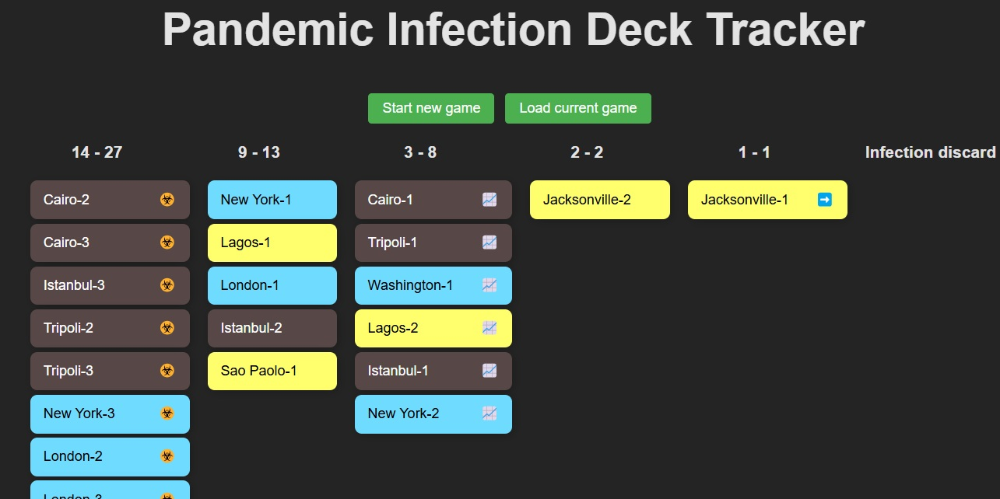

# Pandemic infection tracker

> We can literally not draw London next<br>
..* draws london *

If this has happened to you, the Pandemic Infection Tracker is your savior 👇 <br>



## Technical documentation [TBD]
### Local set-up [TBD]
1. Create a GitHub PAT that has access to your GitHub gists. 
2. Create .env file with `VITE_GITHUB_PAT` and store the token generated in the previous step.
3. Initialize a `deck.json` file on the following format:
```json
[
    {
        "name": "London",
        "color": "blue"
    },
    {
        "name": "Tokyo",
        "color": "red"
    }
]
```

_NOTE: There is not set-up a non-manual way of creating the deck if you swap between games or add cards to the deck._